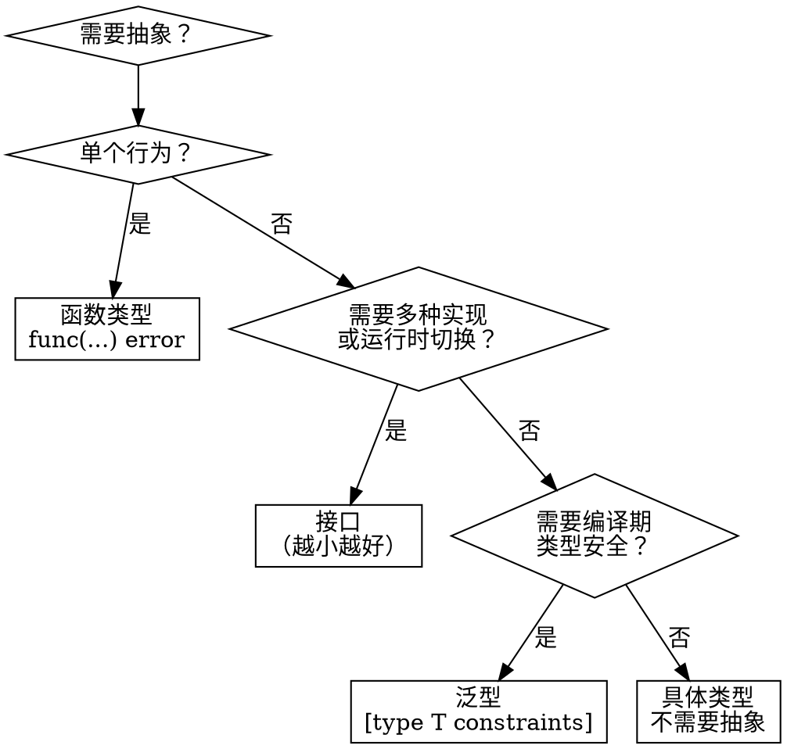

# 接口设计

> 来源：Go 标准库、Google Go Style Guide、Uber Go Style Guide

## 核心原则

1. **越小越好**——单方法接口是理想状态（`io.Reader`、`io.Writer` 各只有 1 个方法）
2. **接口定义在使用方，不在实现方**——消费者定义它需要什么，而不是实现者提供什么
3. **隐式实现**——不需要声明 `implements`，鸭子类型，任何拥有对应方法集的类型自动满足接口

## 速查规则

| 场景 | 推荐做法 |
|------|----------|
| 单个行为抽象 | 接口，命名用 `-er` 后缀 |
| 多方法契约 | 小接口（2-3 个方法），不要超过 5 个 |
| 多种实现且运行时切换 | 接口 |
| 编译期类型安全，单一实现 | 泛型 |
| 一次性行为参数 | 函数类型 `func(...) error` |
| 只用于测试 mock | 在测试文件中定义接口，不在生产代码中 |

## 小接口哲学

Go 标准库 `io` 包是最好的范例——每个接口只描述一个能力：

```go
type Reader interface {
    Read(p []byte) (n int, err error)
}

type Writer interface {
    Write(p []byte) (n int, err error)
}

type Closer interface {
    Close() error
}

type Seeker interface {
    Seek(offset int64, whence int) (int64, error)
}
```

通过组合构建更复杂的能力：

```go
type ReadCloser interface {
    Reader
    Closer
}

type ReadWriteCloser interface {
    Reader
    Writer
    Closer
}
```

### 接口大小对比

✅ **好的设计**——每个接口只描述一个能力：

```go
type Serializer interface {
    Serialize() ([]byte, error)
}

type Deserializer interface {
    Deserialize(data []byte) error
}
```

❌ **不好的设计**——把所有行为塞进一个大接口：

```go
type UserRepo interface {
    Get(id string) (*User, error)
    List(filter Filter) ([]*User, error)
    Create(u *User) error
    Update(u *User) error
    Delete(id string) error
    Count(filter Filter) (int, error)
    BulkCreate(users []*User) error
}
```

消费者如果只需要读取，也被迫依赖全部 7 个方法。

## 接口定义在使用方

✅ **正确**——消费者包定义自己需要的接口：

```go
package userapi

type UserStore interface {
    GetUser(id string) (*User, error)
}

type Handler struct {
    store UserStore
}

func NewHandler(store UserStore) *Handler {
    return &Handler{store: store}
}
```

`userapi` 包不依赖任何实现包，只依赖自己定义的最小接口。

❌ **不推荐**——实现包定义接口：

```go
package postgres

type UserRepo interface {
    GetUser(id string) (*User, error)
    CreateUser(u *User) error
    UpdateUser(u *User) error
    DeleteUser(id string) error
    ListUsers(filter Filter) ([]*User, error)
}
```

问题：消费者被迫依赖完整接口；接口随实现膨胀；消费者和实现包耦合。

**原则**：返回具体类型，参数接受接口。

```go
func NewUserRepoPostgres(conn *sql.DB) *UserRepoPostgres {
    return &UserRepoPostgres{conn: conn}
}
```

## 组合优于继承

✅ **通过嵌入组合小接口**：

```go
type ReadWriter interface {
    Reader
    Writer
}
```

❌ **大而全的单一接口**：

```go
type FileSystem interface {
    Open(name string) (File, error)
    Create(name string) (File, error)
    Remove(name string) error
    Rename(oldname, newname string) error
    Stat(name string) (FileInfo, error)
    Walk(root string, walkFn WalkFunc) error
}
```

应该拆分为 `Opener`、`Remover`、`Stater` 等小接口。

## 隐式实现

Go 的接口是隐式满足的——类型不需要声明自己实现了某个接口：

```go
type Logger interface {
    Log(msg string)
}

type ConsoleWriter struct{}

func (c ConsoleWriter) Log(msg string) {
    fmt.Println(msg)
}

func Process(l Logger) {
    l.Log("done")
}
```

`ConsoleWriter` 没有任何 `implements Logger` 声明，只要有 `Log(string)` 方法就自动满足 `Logger` 接口。

好处：

- **追溯性合规**：为新接口实现旧的类型，不需要修改旧类型
- **无依赖**：实现者不需要导入接口定义的包
- **灵活**：任何包中的任何类型都可以满足接口

## 决策流程图



决策路径：

1. **不需要抽象** → 直接用具体类型
2. **单个行为** → 函数类型 `func(...) error` 通常比单方法接口更轻量
3. **多种实现 / 运行时切换** → 定义小接口
4. **编译期类型安全，单一实现** → 使用泛型 `[type T constraints]`
5. **都不需要** → 具体类型就够了

## 反模式

| 反模式 | 问题 | 修正 |
|--------|------|------|
| 大接口（>5 方法） | 难实现、难测试、违反 ISP | 拆分为多个小接口 |
| 在实现方定义接口 | 耦合、限制消费者 | 在使用方定义 |
| 返回接口 | 限制了实现灵活性 | 返回具体类型，参数接受接口 |
| 接口工厂模式 | Go 不需要 | 用 `NewXXX()` 返回具体类型 |
| getter 接口（只有 getter） | 过度抽象 | 用具体类型或函数类型 |
| 为测试而定义生产接口 | 不必要的抽象 | 在测试文件中定义接口 |
| `type Doer interface { Do() }` | 函数类型更简单 | `type DoFunc func()` 或 `type DoFunc func() error` |

## 命名规范

- **单方法接口**：方法名 + `er` 后缀（`Reader`、`Writer`、`Formatter`、`Stringer`）
- **多方法接口**：描述行为（`ReadWriteCloser`、`HttpClient`）
- **不要**加 `I` 前缀或 `Interface` 后缀（`IReader` ❌、`ReaderInterface` ❌）
- **函数类型**：`Func` 后缀（`http.HandlerFunc`、`middleware.Func`）

## 参考链接

- [Go 标准库 io 包](https://pkg.go.dev/io)
- [Effective Go - Interfaces](https://go.dev/doc/effective_go#interfaces)
- [Google Go Style Guide - Interfaces](https://google.github.io/styleguide/go/decisions#interfaces)
- [Uber Go Style Guide - Interfaces](https://github.com/uber-go/guide/blob/master/style.md#interfaces)
- [Go Proverb: The bigger the interface, the weaker the abstraction](https://www.youtube.com/watch?v=PAAkCSZUG1c)
