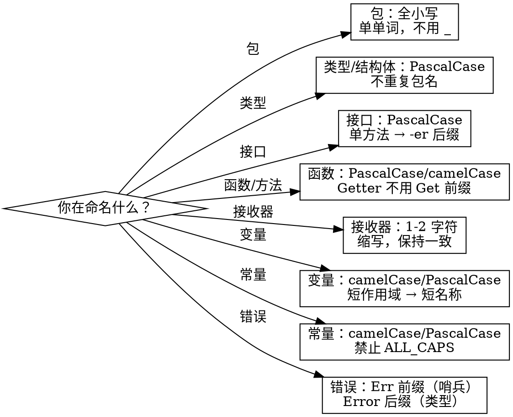

# 命名规范

> 来源：Go 标准库、Google Go Style Guide、Uber Go Style Guide

# Go 命名

## 概述

按照 Go 标准库的方式命名。名称应该**简短、清晰、一致** —— 不需要创意。命名更像是一门艺术而非科学——Go 语言的命名通常比其他
语言更简短。

## 速查表

| 标识符 | 风格 | 导出 | 示例 |
|--------|------|------|------|
| 包 | `lowercase` | N/A | `http`, `json`, `filepath` |
| 类型 / 结构体 | `PascalCase` | 导出 → `PascalCase` | `Server`, `http.Handler` |
| 接口 | `PascalCase` + `-er` | 导出 → `PascalCase` | `Reader`, `Stringer`, `io.Reader` |
| 函数 | `PascalCase` / `camelCase` | 导出 / 未导出 | `Serve()`, `parseHeader()` |
| 方法 | `PascalCase` / `camelCase` | 导出 / 未导出 | `Write()`, `readAll()` |
| 变量 | `PascalCase` / `camelCase` | 导出 / 未导出 | `buf`, `maxRetries` |
| 常量 | `PascalCase` / `camelCase` | 导出 / 未导出 | `MaxSize`, `defaultPort` |
| 接收器 | 1-2 字符缩写 | N/A | `s`, `rv`, `tx` |
| 枚举值 | `PascalCase` | 导出 → `类型_值` | `Color_Red` |
| 错误哨兵 | `PascalCase` | 导出 → `Err...` | `ErrNotFound` |
| 测试函数 | `Test + PascalCase` | N/A | `TestServeHTTP` |
| 基准测试 | `Benchmark + PascalCase` | N/A | `BenchmarkParse` |

## 包

全小写、单个单词、不用下划线或混合大小写。

```
✅ http   json   filepath   strconv
❌ httputil  jsonParser  file_path  common  utils  helpers
```

**避免泛化名称：** `util`、`common`、`base`、`helpers`。将辅助函数移到使用它的包中，或创建具体的包（`httputil` → `http` 或 `internal/httpx`）。

**包名 = 导入路径的最后一部分：** `encoding/json` → `json`。使用者写 `json.Marshal`，不是 `json.JSONMarshal`。

**不要创建 `package.go`：** 不要以包名命名文件。使用有意义的名称，如 `server.go`、`handler.go`、`options.go`。

## 类型和结构体

`PascalCase`。名称不应重复包名。

```go
// ✅ good — 包 user
type User struct { ... }
type Service struct { ... }

// ❌ bad — 重复包名
type UserService struct { ... }  // 在包 "user" 中，调用者写 user.UserService
```

```go
// ✅ good — 包 http
type Handler struct { ... }
type ResponseWriter interface { ... }

// ❌ bad
type HTTPHandler struct { ... }  // 调用者写 http.HTTPHandler — "HTTP" 重复
```

## 接口

`PascalCase`。单方法接口使用方法名 + `-er` 后缀。

```go
type Reader interface { Read(p []byte) (n int, err error) }
type Writer interface { Write(p []byte) (n int, err error) }
type Stringer interface { String() string }
type Marshaler interface { Marshal() ([]byte, error) }
```

**不要用 `I` 或 `Interface` 前缀：**

```go
❌ type IReader interface { ... }
❌ type ReaderInterface interface { ... }
```

**接口定义在使用方：** 在*使用*接口的地方定义，而非*实现*接口的地方。需要流式输入的函数应在自己的包中定义 `io.Reader`。

## 函数和方法

导出用 `PascalCase`，未导出用 `camelCase`。

**仅在需要消歧义时添加返回类型后缀：**

```go
// ✅ good
func NewServer(addr string) *Server
func Parse(text string) (Expr, error)

// ❌ bad — 多余的类型后缀
func NewServerReturnPointer(addr string) *Server
```

**不要与包名重复：**

```go
// 在包 http 中：
✅ func Handle(pattern string, handler Handler)
❌ func HTTPHandle(pattern string, handler Handler)
```

**Getter：** 不要用 `Get` 前缀。

```go
// ✅ good
func (u *User) Name() string

// ❌ bad
func (u *User) GetName() string
```

**布尔 Getter** 可以使用 `Is`、`Has`、`Can`、`Should`：

```go
func (u *User) IsActive() bool
func (n *Node) HasChildren() bool
```

**构造函数：** 使用 `New` 或 `NewXxx`。

```go
func New(addr string) *Server          // 包 "server" — 调用者：server.New()
func NewServer(addr string) *Server    // 包 "http" — 调用者：http.NewServer()
```

## 接收器

类型名的短缩写，在**该类型的所有方法中保持一致**。

```go
type Server struct { ... }

func (s *Server) Start() error { ... }
func (s *Server) Stop()  error { ... }
func (s *Server) Addr()  string { ... }
```

**规则：**
- 1-3 个字符
- 始终使用指针接收器（除非是不可变值类型且有充分理由）
- 同一类型的所有方法使用相同的接收器名
- 禁止使用 `self`、`this`、`me`

```go
❌ func (server *Server) Start()  // 太长
❌ func (self *Server) Start()    // 禁止 self/this
❌ func (s *Server) Start()
   func (srv *Server) Stop()     // 不一致
```

## 变量

未导出用 `camelCase`，导出用 `PascalCase`。

**短生命周期用短名，长生命周期用描述性名称：**

```go
// 短作用域 — 简短即可
for i, v := range items { ... }
if f, err := os.Open(name); err != nil { ... }
r := bufio.NewReader(rd)

// 包级或长作用域 — 要有描述性
var defaultTimeout = 30 * time.Second
var ErrNotFound = errors.New("not found")
```

**常用缩写（优先于长名称）：**

| 缩写 | 含义 |
|------|------|
| `i`, `j`, `k` | 循环索引 |
| `v` | 值 |
| `k` | 键 |
| `n` | 计数 / 数量 |
| `s` | 字符串 |
| `r` | 读取器 |
| `w` | 写入器 |
| `b` | 缓冲区 / 字节 |
| `f` | 文件 / 函数 |
| `fn` | 函数值 |
| `err` | 错误 |
| `ok` | 布尔成功标志 |
| `ctx` | context.Context |
| `tx` | 事务 |
| `mu` | 互斥锁 |
| `buf` | 缓冲区 |
| `msg` | 消息 |
| `req`, `resp` | 请求、响应 |
| `cfg` | 配置 |
| `id` | 标识符 |

## 常量

与变量规则相同。**禁止使用全大写（ALL_CAPS）。**

```go
✅ const MaxRetries = 3
✅ const defaultPort = 8080
❌ const MAX_RETRIES = 3
❌ const DEFAULT_PORT = 8080
```

**使用 `iota` 的枚举模式：**

```go
type Color int

const (
    ColorRed   Color = iota
    ColorGreen
    ColorBlue
)
```

导出枚举值在类型名单独不够明确时使用 `Type_Value` 模式。

## 缩写词

保持大小写一致 —— 不要混用：

```go
✅ HTTPClient, userID, apiURL, tcpConn, jsonParser
❌ HttpClient, UserId, ApiUrl, TcpConn, JsonParser
```

| 缩写 | PascalCase | camelCase |
|------|-----------|-----------|
| API | `APIEndpoint` | `apiEndpoint` |
| HTTP | `HTTPServer` | `httpServer` |
| URL | `URLPath` | `urlPath` |
| ID | `UserID` | `userID` |
| JSON | `JSONDecoder` | `jsonDecoder` |
| XML | `XMLElement` | `xmlElement` |
| TCP | `TCPConn` | `tcpConn` |
| IP | `IPAddr` | `ipAddr` |
| SSH | `SSHTunnel` | `sshTunnel` |
| TLS | `TLSConfig` | `tlsConfig` |
| SQL | `SQLQuery` | `sqlQuery` |
| DB | `DBConn` | `dbConn` |
| IO | `IOReader` | `ioReader` |
| RPC | `RPCClient` | `rpcClient` |
| GPU | `GPUInfo` | `gpuInfo` |

## 错误

哨兵错误：`Err` 前缀 + `PascalCase`。

```go
var ErrNotFound    = errors.New("not found")
var ErrTimeout     = errors.New("timeout")
var ErrPermission  = errors.New("permission denied")
```

错误类型：`Error` 后缀。

```go
type SyntaxError struct {
    Line int
    Msg  string
}

func (e *SyntaxError) Error() string { ... }
```

## 避免重复

避免在标识符中重复包名：

```go
// 包 "user"：
✅ user.New()        user.Get()       user.ID
❌ user.NewUser()    user.GetUser()   user.UserID
```

**例外：** 当通用名称缺少上下文会产生歧义时：

```go
// 在包 "http" 中 — "New" 有歧义（新建什么？）
✅ http.NewServer()
✅ http.NewRequest()
```

## 常见错误

| 错误 | 修正 |
|------|------|
| `http` 包中用 `HTTPHandler` | `Handler` —— 包名已提供上下文 |
| `GetName()` | `Name()` —— 去掉 `Get` 前缀 |
| `MAX_SIZE` 常量 | `MaxSize` —— 禁止全大写 |
| `(self *Server)` 接收器 | `(s *Server)` —— 用缩写 |
| `IReader` 接口 | `Reader` —— 不要 `I` 前缀 |
| `utils` 包 | 将辅助函数移到使用者或具体的包中 |
| 混用缩写大小写 `UserId` | `userID` —— 缩写保持一致 |
| `func (s Server) Method()` | `func (s *Server) Method()` —— 用指针接收器 |
| 同一类型使用不同接收器名 | 选一个，到处用 |

## 决策流程图


