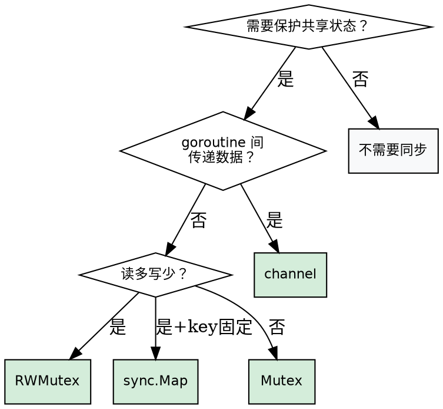
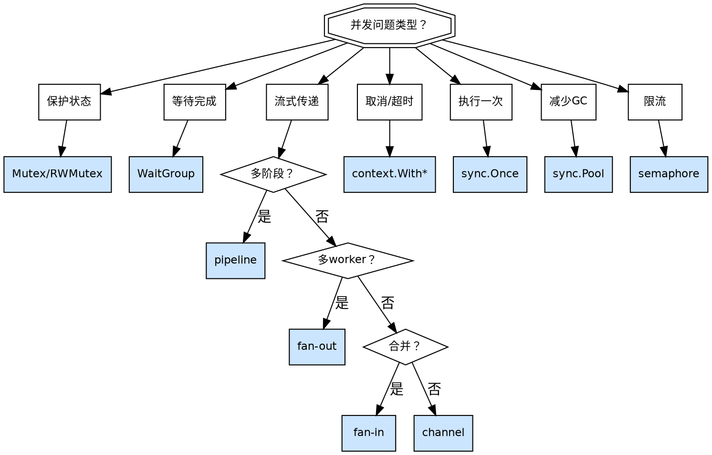

# 并发编程

> 来源：Go 标准库、Google Go Style Guide、Uber Go Style Guide

## 核心原则

1. **不要通过共享内存来通信，通过通信来共享内存**（channel 优先）
2. **goroutine 必须有明确的生命周期管理**——知道何时启动、何时结束
3. **共享可变状态必须保护，没有例外**

## 速查规则

| 场景 | 推荐做法 |
|------|----------|
| 保护共享可变状态 | `sync.Mutex` / `sync.RWMutex` |
| 读多写少的缓存 | `sync.RWMutex` 或 `sync.Map` |
| 等待一组 goroutine 完成 | `sync.WaitGroup` |
| 一次性初始化 | `sync.Once` |
| 对象复用（减少 GC） | `sync.Pool` |
| goroutine 间传递数据 | channel |
| 取消/超时/截止时间 | `context.WithCancel` / `WithTimeout` |
| 流水线处理 | pipeline channel 模式 |
| 限流 | semaphore（`golang.org/x/sync/semaphore`）或 buffered channel |

## goroutine 生命周期管理

### ✅ 正确：带取消和完成通知

```go
func worker(ctx context.Context, jobs <-chan int, done chan<- struct{}) {
    defer close(done)
    for {
        select {
        case <-ctx.Done():
            return
        case j, ok := <-jobs:
            if !ok {
                return
            }
            process(j)
        }
    }
}
```

### ❌ 错误：即发即弃

```go
func run() {
    for i := 0; i < 100; i++ {
        go func(n int) { process(n) }(i)
    }
}
```

关键：每个 goroutine 都应有清晰的退出条件。

## sync 原语选择

| 原语 | 适用场景 |
|------|----------|
| `sync.Mutex` | 读写都频繁的共享状态 |
| `sync.RWMutex` | 读多写少 |
| `sync.WaitGroup` | 等待一组 goroutine 完成 |
| `sync.Once` | 一次性初始化 |
| `sync.Pool` | 临时对象复用，减少 GC |
| `sync.Map` | 读多写少、key 稳定的并发缓存 |
| `sync.Cond` | goroutine 间事件通知/等待 |

```go
type SafeCounter struct {
    mu sync.Mutex
    m  map[string]int
}
func (c *SafeCounter) Inc(key string) {
    c.mu.Lock()
    c.m[key]++
    c.mu.Unlock()
}

func fetchAll(urls []string) []string {
    var mu sync.Mutex
    var wg sync.WaitGroup
    var imgs []string
    for _, u := range urls {
        wg.Add(1)
        go func(url string) {
            defer wg.Done()
            img := fetch(url)
            mu.Lock()
            imgs = append(imgs, img)
            mu.Unlock()
        }(u)
    }
    wg.Wait()
    return imgs
}

var bufPool = sync.Pool{New: func() any { return new(bytes.Buffer) }}
func process(data []byte) {
    b := bufPool.Get().(*bytes.Buffer)
    defer func() { b.Reset(); bufPool.Put(b) }()
    b.Write(data)
}
```

## Channel 模式

### 生产者-消费者

```go
func producer(items []int) <-chan int {
    ch := make(chan int)
    go func() {
        defer close(ch)
        for _, item := range items {
            ch <- item
        }
    }()
    return ch
}
```

### Fan-out（分发） / Fan-in（合并）

```go
func fanOut(input <-chan Task, n int) []<-chan Result {
    workers := make([]<-chan Result, n)
    for i := 0; i < n; i++ {
        out := make(chan Result)
        go func() { defer close(out); for t := range input { out <- process(t) } }()
        workers[i] = out
    }
    return workers
}
func fanIn(channels ...<-chan Result) <-chan Result {
    merged := make(chan Result)
    var wg sync.WaitGroup
    for _, ch := range channels {
        wg.Add(1)
        go func(c <-chan Result) { defer wg.Done(); for r := range c { merged <- r } }(ch)
    }
    go func() { wg.Wait(); close(merged) }()
    return merged
}
```

### Pipeline（多阶段串行）

```go
func stage(ctx context.Context, in <-chan int, fn func(int) int) <-chan int {
    out := make(chan int)
    go func() {
        defer close(out)
        for n := range in {
            select {
            case <-ctx.Done():
                return
            case out <- fn(n):
            }
        }
    }()
    return out
}

func runPipeline(ctx context.Context, input <-chan int) <-chan int {
    return stage(ctx, stage(ctx, input, func(n int) int { return n * 2 }), func(n int) int { return n + 1 })
}
```

### Select + timeout / cancellation

```go
func sendOrTimeout(ch chan<- int, val int, timeout time.Duration) error {
    select {
    case ch <- val:
        return nil
    case <-time.After(timeout):
        return fmt.Errorf("send timed out")
    }
}

func recvOrCancel(ctx context.Context, ch <-chan int) (int, error) {
    select {
    case v, ok := <-ch:
        if !ok { return 0, fmt.Errorf("channel closed") }
        return v, nil
    case <-ctx.Done():
        return 0, ctx.Err()
    }
}
```

## Context 传播

### ✅ 正确：context 作为第一个参数传递

```go
func (s *Service) FetchUser(ctx context.Context, id string) (*User, error) {
    req, err := http.NewRequestWithContext(ctx, http.MethodGet, s.url+"/"+id, nil)
    if err != nil {
        return nil, fmt.Errorf("creating request: %w", err)
    }
    resp, err := s.client.Do(req)
    if err != nil {
        return nil, fmt.Errorf("fetching user: %w", err)
    }
    defer resp.Body.Close()
    var user User
    if err := json.NewDecoder(resp.Body).Decode(&user); err != nil {
        return nil, fmt.Errorf("decoding response: %w", err)
    }
    return &user, nil
}
```

### ❌ 错误：`type BadService struct { ctx context.Context }`

context 应作为函数第一个参数传递，不应存储在结构体中。

## 决策流程图

### 共享状态决策图



### 并发模式决策图



## 反模式

| 反模式 | 问题 | 修正 |
|--------|------|------|
| goroutine 泄漏 | goroutine 永远不会结束 | 用 context 取消或 done channel |
| 无缓冲 channel 死锁 | 两端同时阻塞 | 用 buffered channel 或 `select` + `default` |
| 忘记 `WaitGroup.Add` | 计数不正确 | 在启动 goroutine **前**调用 `Add(1)` |
| 竞态条件 | 多 goroutine 读写共享变量不加锁 | 用 `go test -race` 检测，加锁或用 channel |
| 忽略 context 取消 | 不检查 `ctx.Done()` | 在循环和阻塞操作中检查 `ctx` |
| 把 context 存入 struct | context 应作为参数传递 | 作为函数第一个参数传递 |
| 过度使用 goroutine | 顺序逻辑不需要并发 | 先写顺序代码，确认需要再加 |
| 在锁内执行 I/O | 持有锁时做网络/文件操作 | 锁内只保护内存操作，I/O 放锁外 |
| 忘记关闭 channel | 消费者无法退出 `range` | 生产者完成后 `close(channel)` |
